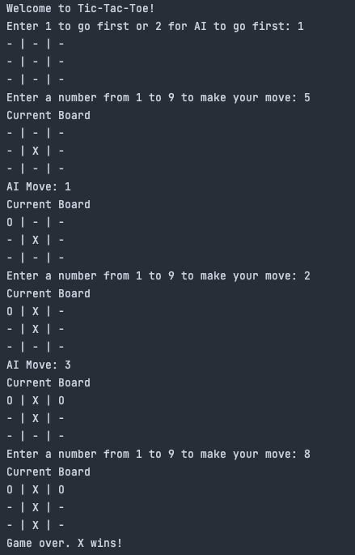
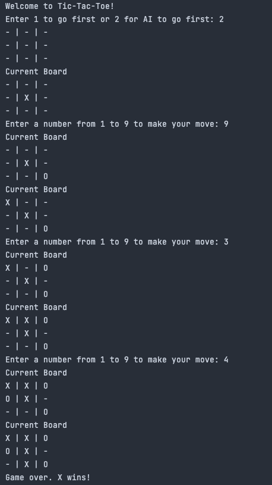

# Tic-Tac-Toe Game using Minimax Algorithm

A simple Tic-Tac-Toe game implemented in Python using the minimax algorithm. The game allows for a player vs. AI mode, where the AI opponent makes intelligent moves using the minimax algorithm.

## Features
- Player vs. AI mode: Challenge the AI opponent with intelligent move choices.
- Intelligent AI moves: The AI opponent uses the minimax algorithm to make optimal moves.

## Technologies Used
- Python 3

## Installation
1. Clone the repository:
2. Change into the project directory:
3. Run

## How to Play
1. Run the Python script to start the game:
2. Follow the on-screen instructions to select the game mode and make moves.
3. Make your moves by entering the corresponding number for the position on the board.

## Screenshots

  
  

## Future Enhancements
- Player vs. Player mode
- Implement a graphical user interface (GUI) for a more immersive gameplay experience.
- Add different difficulty levels for the AI opponent.
- Allow customization of player names and symbols.

## Contributing
Contributions, bug reports, and feature requests are welcome. Feel free to open an issue or submit a pull request.

## License
This project is licensed under the MIT License.

## Contact
For any questions or suggestions, please feel free to reach out.

